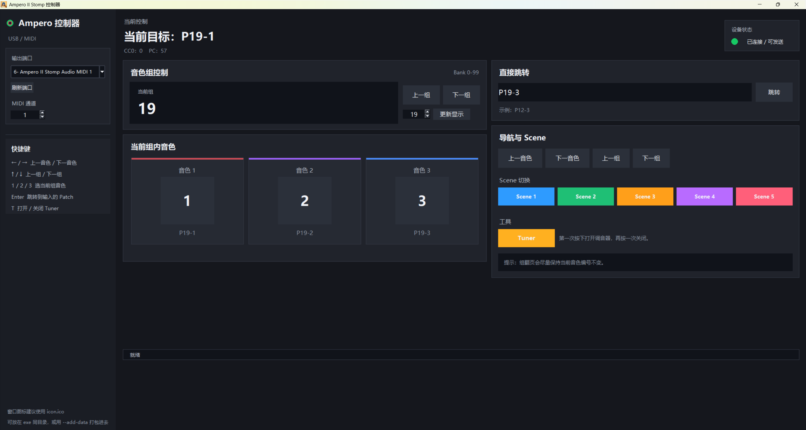

# 🎛️ Hotone Ampero II stomp Desk ToneSwitcher
Hotone Ampero II stomp 效果器桌面音色切换助手

一个基于 **Python + Tkinter + MIDI** 的桌面控制器，用来从电脑控制 **Hotone Ampero II Stomp** 切换音色、翻组、切换 Scene，以及打开/关闭 Tuner。

这个项目最初是为了一个很实际的需求：  
**不想总是弯腰踩效果器，也不想每次都手动切换 patch，于是干脆写一个电脑端的小控制台。**

---

## ✨ 功能特性

- 🎚️ 自动识别可用 MIDI 输出端口
- 🎛️ 选择 MIDI 通道
- 🎵 直接切换到任意 Patch（如 `P12-3`）
- ⏮️ / ⏭️ 上一音色、下一音色
- ⏪ / ⏩ 上一组、下一组
- 🎨 切换 Scene 1 ~ 5
- 🎯 打开 / 关闭 Tuner
- 💾 自动记住上次使用的端口、通道、Bank
- 🌙 中文界面 + 深色风格
- 🪟 支持打包为 Windows `.exe`

---

## 🖼️ 界面预览

你可以在这里放一张程序截图，例如：

```text
repo/
├─ ampero_gui.py
├─ README.md
└─ assets/
   └─ preview.png
```

然后在 README 中加入：

```md

```

---

## 📦 环境要求

- Python 3.9+
- Windows（优先测试）
- Hotone Ampero II Stomp
- USB MIDI 连接，或外接 MIDI 接口

---

## 🚀 安装

先克隆仓库：

```bash
git clone https://github.com/yourname/ampero-midi-controller.git
cd ampero-midi-controller
```

安装依赖：

```bash
pip install mido python-rtmidi
```

---

## ▶️ 运行

```bash
python ampero_gui.py
```

---

## ⚙️ Ampero 设备设置

为了让电脑能够正常控制 Ampero II Stomp，请先在设备中检查 MIDI 设置：

- `Global > MIDI Settings`
- 将 `MIDI IN SOURCE` 设为：
  - `USB Only`，或者
  - `Mixed`
- 将 `INPUT CH(USB)` 设为和程序中相同的通道，例如 `1`

只要程序里能识别到类似下面这样的端口，就基本说明 MIDI 通路已经通了：

```text
6- Ampero II Stomp Audio MIDI 1
```

---

## 🎮 当前支持的控制功能

### Patch 切换
- 直接输入 `P00-1` 到 `P99-3`
- 点击按钮切换当前组中的 `1 / 2 / 3`

### Patch 导航
- 上一音色 / 下一音色
- 上一组 / 下一组

### Scene 切换
- Scene 1 ~ 5

### Tuner
- 支持通过 MIDI 打开 / 关闭 Tuner

---

## ⌨️ 快捷键

- `1 / 2 / 3`：切换当前组中的 1 / 2 / 3 号音色
- `← / →`：上一音色 / 下一音色
- `↑ / ↓`：上一组 / 下一组
- `T`：打开 / 关闭 Tuner

---

## 🧩 自定义程序图标

程序会优先自动读取脚本同目录下的图标文件：

```text
icon.ico
```

你只需要把图标放到和 `ampero_gui.py` 同一个目录即可：

```text
ampero_gui.py
icon.ico
```

如果你想改文件名，可以在代码中修改：

```python
ICON_ICO = APP_DIR / "icon.ico"
ICON_PNG = APP_DIR / "icon.png"
```

建议 `.ico` 文件包含多个尺寸，例如：

- 16×16
- 32×32
- 48×48
- 256×256

这样在窗口标题栏、任务栏和资源管理器中显示会更正常。

---

## 🏗️ 打包为 EXE

安装 PyInstaller：

```bash
pip install pyinstaller
```

然后执行：

```bash
pyinstaller --onefile --windowed --name "Ampero MIDI Controller" --icon icon.png --hidden-import mido.backends.rtmidi .\ampero_gui.py
```

打包完成后，生成的文件通常位于：

```text
dist/Ampero MIDI Controller.exe
```

---

## 📁 项目结构

```text
ampero-midi-controller/
├─ ampero_gui.py
├─ README.md
├─ icon.ico
└─ requirements.txt
```

---

## 📝 requirements.txt

`requirements.txt`：

```txt
mido
python-rtmidi
```

安装时更方便：

```bash
pip install -r requirements.txt
```

---

## ⚠️ 说明

- 本项目目前主要针对 **Ampero II Stomp** 开发和测试
- 不同系统、不同 MIDI 后端下，端口名称可能略有不同
- 如果你在设备端手动切换状态，GUI 中的显示状态不一定会立刻同步
- 这个项目是一个轻量级控制器，不是官方编辑器，也不修改效果器内部参数

---

## 🛣️ Roadmap

后续可能会加入的功能：

- [ ] 收藏常用音色组
- [ ] 一键切换演出 / 练琴模式
- [ ] 更像硬件面板的 UI
- [ ] 可自定义快捷键
- [ ] 更完整的状态同步
- [ ] 多设备兼容支持

---

## 🤝 欢迎贡献

欢迎提 issue、PR 或者提出改进建议。

如果你也在用 Ampero II Stomp，并且想要一个更顺手的桌面控制器，欢迎一起完善这个项目。

---

## 📄 License
- MIT License

---

## ❤️ 致谢

OpenAI chatGPT！
